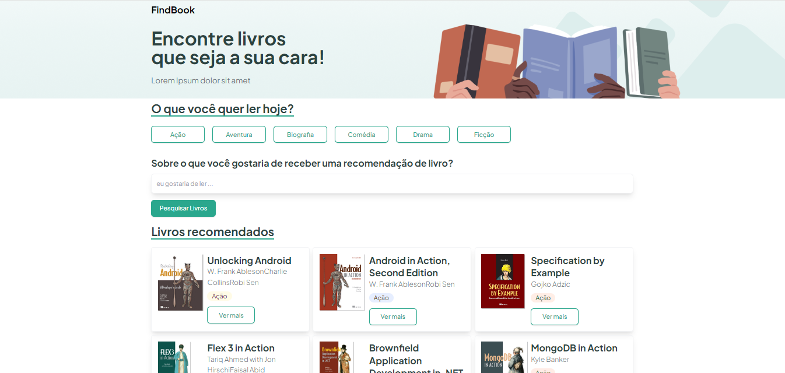

# Projeto Front-end Findbook (React)

Esse projeto foi realizado em uma imersão da HeroPro como forma de passar conhecimentos em React, Node e MongoDB. O projeto foi simplificado, consistindo o front de ler os livros do backend e mostrar no site. Não foi realizado nenhum tipo de busca por nome ou categoria do livro.

## Design do projeto

<!--  -->

## Link da imersão

Detalhes sobre a imersão [Semana do Herói [Edição 4]](https://herocodebr.notion.site/RoadMap-Semana-do-Her-i-Edi-o-4-7bf98455f83b46e6a808c66a37be405a)

## Frameworks utilizados

- Vite (https://vitejs.dev/)
- Tailwind (https://tailwindcss.com/)

## Pacotes utilizados

### ClassNames

- **Descrição**: permite passar um array de classes CSS na propriedade className de um componente.
- **Exemplo**: className = {classNames(["classeCSS1", "classeCSS2"])}
- **Instalação**: npm install classnames

### React-Router-DOM

- **Descrição**: permite trabalhar com rotas entre as páginas (Links).
- **Instalação**: npm i react-router-dom

### Axios

- **Descrição**: permite fazer chamadas em APIs (GET, POST, PUT, ...)
- **Instalação**: npm i axios

### Tanskrack/react-query

- **Descrição**: permite automaticamente fazer cache dos dados. Isso significa que quando o usuáio visitar a página, os dados já estão disponíveis.
- **Instalação**: npm i @tanstack/react-query
